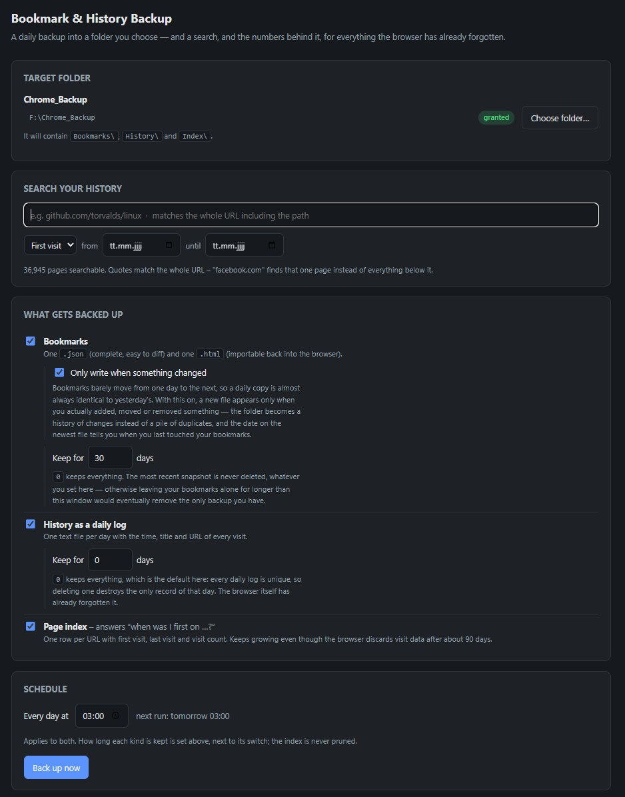
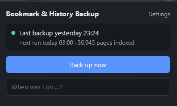
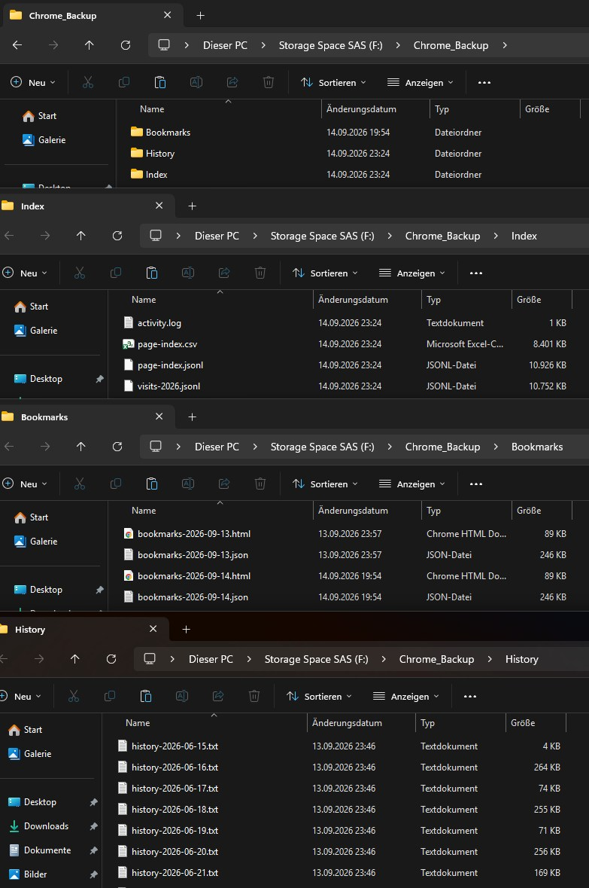
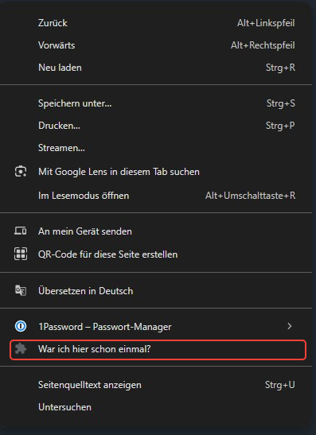
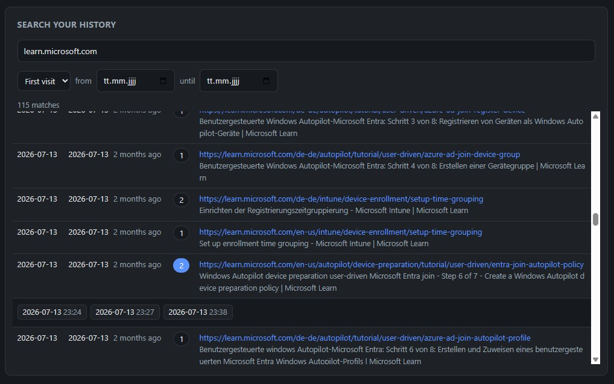
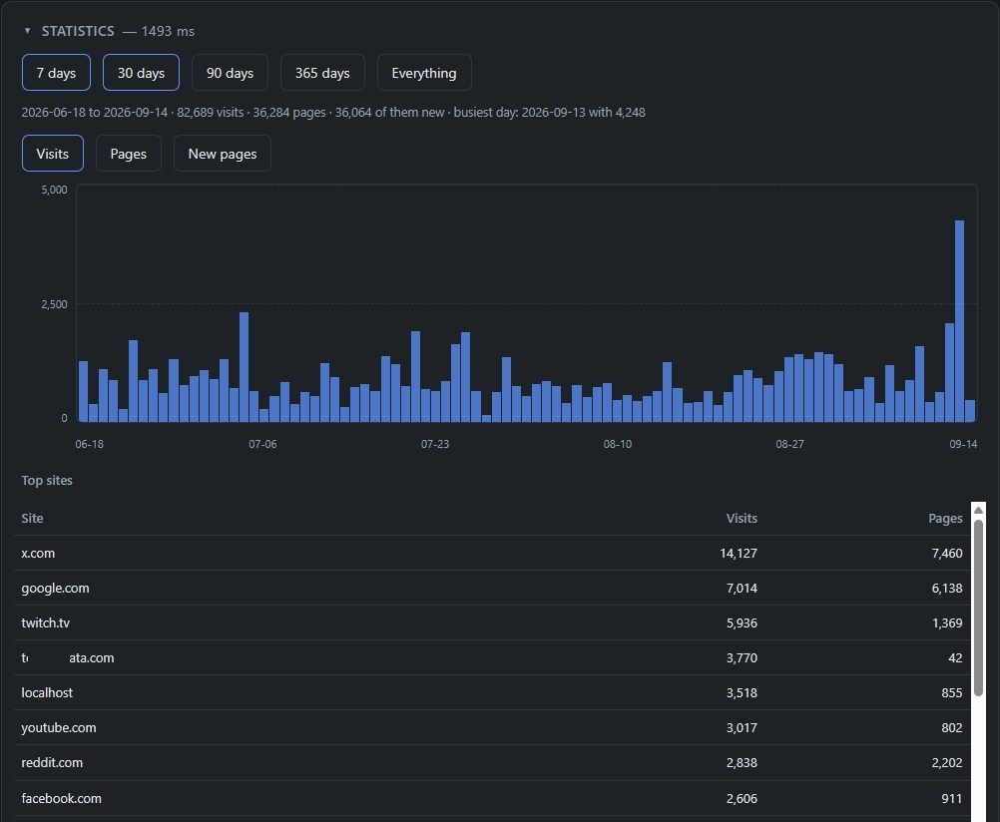

# Bookmark & History Backup

A Manifest V3 extension for **Chrome and Edge** that writes your bookmarks and
browsing history into a folder of your choice once a day — and answers the one
question the browser's own history cannot:

> "When was I first on `github.com/xyz`?"

Both browsers discard visit data after roughly 90 days. The **page index** this
extension keeps does not: one row per URL with first visit, last visit and visit
count, growing for as long as the extension is installed.

That index is worth reading, so the settings page is not only settings:

- a **search** over the whole URL including the path, and over the title, with
  the individual timestamps behind every row
- **statistics**: visits, distinct pages and newly found pages per day or week,
  and the sites you spend your time on
- an **activity log** of every run, restore and database change

Everything runs locally. The extension has no network access and talks to no
server.



## How this was built

Nearly all the code here was written by [Claude Code](https://claude.com/claude-code),
Anthropic's coding agent, using Claude Opus 5, over two long sessions and working
from a conversation rather than a specification. Direction, design decisions and
testing against real data came from the repository owner. Every commit names Claude
as co-author.

Worth stating plainly, because the split shows in what went wrong. Three bugs that
would have cost data were caught before they could, and not one of them by a test:

- a retention rule that, together with only writing bookmarks when they change,
  would eventually have pruned the last remaining backup
- the first run after picking a folder exporting an empty database straight over
  the index it was about to read
- visits stored twice, because the browser reports `visitTime` with a
  sub-millisecond fraction while an exported timestamp comes back as a whole one

Each surfaced from someone asking what would happen in a case nobody had tried.
The tests came afterwards, and hold those cases down now.

## Browsers

Tested in **Chrome** and **Edge**. Other Chromium browsers — Brave, Vivaldi, Opera —
use the same APIs and will very likely work, but have not been tried.

**Firefox will not work**, and not for want of a few tweaks: it deliberately does
not implement `showDirectoryPicker()`, so writing into a folder you choose — the
whole point of this — is not available there at all.

Chrome and Edge keep separate bookmarks and separate history, and an extension only
ever sees the browser it runs in. Installing it in both is fine; give each its own
target folder, or they will overwrite each other's index files.

## Install

No Web Store, no account, no installer — you point the browser at a folder.

1. Download the ZIP from [Releases](../../releases), or clone this repository
2. **Extract it somewhere permanent** — not your Downloads folder. An unpacked
   extension is not copied into the browser; the browser just remembers the path
   and reads the files back from there every time the service worker restarts.
   Delete or move the folder and the extension stops working. (Your data would
   survive: it hangs off the extension ID, which is pinned in the manifest, so
   putting the folder back anywhere and loading it again restores everything.)
3. Open `chrome://extensions` — in Edge, `edge://extensions`
4. Turn on **Developer mode** (top right)
5. **Load unpacked** → select the extracted `bookmark-history-backup` folder (the
   one containing `manifest.json`); from a clone, select `extension/`
6. Click the icon → **Settings** → **Choose folder…**

The browser will warn that the extension can read your browsing history. It can —
that is the entire job. Nothing leaves your machine.

**To update:** download the new ZIP, extract it over the same folder, then press the
reload arrow on the extension's card. Do **not** press Remove and add it again —
removing deletes the extension's storage, which is where your settings and the whole
page index live. Overwrite-and-reload keeps everything.

`VERSION.txt` in the folder says which version you extracted. If it disagrees with
the version on the extension's card, the reload was missed.

The folder can be anywhere, including a second partition, e.g. `D:\Chrome Backup`.
The browser will ask for permission once.

Only the folder's name is shown afterwards, never its full path — the File System
Access API deliberately withholds that from extensions, and there is no way around
it. The line underneath is a free-text note; put the path there yourself if you
want to see at a glance which folder is configured.



## What ends up in the folder

```
D:\Chrome Backup\
├── Bookmarks\
│   ├── bookmarks-2026-09-13.json     full tree, easy to diff
│   └── bookmarks-2026-09-13.html     Netscape format, re-importable
├── History\
│   └── history-2026-09-13.txt        time, title and URL of every visit
└── Index\
    ├── page-index.csv                one row per URL, cumulative, opens in Excel
    ├── page-index.jsonl              same, machine-readable
    ├── visits-2026.jsonl             every individual visit, one file per year
    └── activity.log                  every run, restore and migration
```



## Retention

Bookmarks and history are kept on separate clocks, because they are not the same
kind of thing.

A **bookmark** file is a complete snapshot of a slowly changing state — today's is
almost always identical to yesterday's. Default: keep 30 days, and *only write when
something actually changed*, so the folder becomes a record of when you edited your
bookmarks rather than a pile of duplicates.

A **history** log is unique. Delete it and that day is gone, since the browser forgot it
long ago. Default: `0`, keep everything.

`0` is available for both. Whatever the setting, **the most recent snapshot is never
deleted** — otherwise leaving your bookmarks untouched for longer than the retention
window would quietly remove the last backup you had.

The index is never pruned at all.

## Search

In the popup, and in more detail in the settings page. Searching covers the
**whole URL including the path** as well as the page title. Scheme and `www.`
are ignored:

| Query | matches, among others |
|---|---|
| `github.com/torvalds` | `https://github.com/torvalds/linux` |
| `/pull/` | every pull request page you ever had open |
| `jira` | hits in the host, in the path, or in the title |
| `"facebook.com"` | that page and nothing below it — see below |

Right-clicking a page or a link puts **"Have I been here before?"** in the context
menu. It opens the settings page with that address already quoted in the search
box — the question usually turns up while browsing, not while in the settings.



*Shown here in a German browser: that one entry follows the browser's language, everything else is English.*

The index only knows what a backup has written, so a page opened since last night
is not in it yet, and answering "no matches" there would be a lie about somewhere
you were an hour ago. Asked from the context menu, a miss therefore goes on to the
browser's own history, and **takes that page into the index on the spot** — same
rows tonight's backup would have collected, merged the same way, so that run finds
nothing left to do. The answer then arrives as an ordinary result row with its
timestamps behind it.

Only from the menu. A quoted query typed by hand is someone looking around, and
looking should not write; it reports what the browser knows instead.

That entry is the one string of this extension that appears inside the browser's
own menus, so it is the only one that follows the *browser's* language instead of
the extension's English: `_locales/en` and `_locales/de` today, anything else
falls back to English. Adding a language is a directory with one JSON file in it,
and the self-test fails if a message is missing from any of them — Chrome does not
complain about that, it just draws an empty menu entry.



**Quotes mean the whole URL.** `facebook.com` matches every photo, message and
profile you ever opened there; `"facebook.com"` matches the front page alone. The
scheme, `www.` and a trailing slash are ignored on both sides, so
`"https://www.facebook.com/"` is the same query.

Each row carries two dates: **first visit** and **last visit**. Click either
header to sort by it, click the one already sorted to turn it around. First visit
is the default, oldest first, because that is what the index exists for — but
"what did I have open yesterday" is a question about the other column. Click the
visit count to expand a row into the individual timestamps.

The two date fields narrow the results to a window, with either end optional: a
`from` alone means "since then", a `to` alone means "before that". The dropdown
in front of them says which of the two dates they apply to, deliberately
independent of the sort order — otherwise clicking a header would silently change
what a filter you had already set means. They work without a search term as well,
which answers a different question: what did I find that week.

Browsers keep counting visits after discarding the underlying timestamps, so that
total can exceed the number of timestamps anyone still has. When that happens the
expanded row says so rather than quietly showing fewer.

## Statistics

Second to last on the settings page, collapsed by default — and that is not just
tidiness: nothing is counted until you open it, so the page itself loads exactly
as fast as it would without it. The result is kept while the page stays
open, and each window is counted once.



One window switch applies to everything in the box — `7 · 30 · 90 · 365 days ·
everything` — so the chart and the ranking underneath can never disagree about
the period they describe. The scale on the left rounds up to a round number, dates
run along the bottom, and hovering a bar gives its exact figure. The bars show **visits**, **pages** or **new pages**. A *visit* is one opening of
one page, a *page* is one URL counted once however often it was opened in that
bucket, and *new pages* are the ones seen for the first time there. Visits
climbing while pages stay flat means the same few pages over and over. Past 90 days a bar is a week rather
than a day; a year of daily bars would be under three pixels each.

Underneath, the 25 most visited sites in the same window, by host with `www.`
folded away. `test.example.com` and `shop.example.com` stay separate — telling a
real domain from a subdomain would need the public suffix list, and that is a file
someone has to keep up to date.

Everything here is counted from the visits this extension holds, never from the
browser's own visit counter. That counter survives the timestamps it belongs to,
so it cannot be split by day and would make the ranking contradict the chart above
it. It appears in exactly one place, the expanded search row, where it is labelled
as the browser's number and explains a gap.

Cost, measured on a database of 100,000 visits: 10 ms for a week, 31 ms for a
month, 344 ms for everything. The visit store is keyed by `[url, timestamp]`, so
the keys alone carry the whole row and the scan never deserialises anything.

## Import from the browser once

Settings → Maintenance → **Import from the browser's history**.

The browser's history is a rolling ~90-day window; what is in it today is gone in three
months. This makes one pass over the whole window, writes a daily log for every day
it covers, and fills the index with the matching timestamps. A minute or two, and
worth doing on the day you install.

Afterwards the daily run takes over and only looks at the last few days.

The other button in that section, **Restore from your backup folder**, goes the
opposite way — see [Restoring](#restoring).

## When it stops

A backup tool fails quietly. The alarm does not fire, the browser stays closed for
a week, the same error repeats every night — and none of that is visible until the
day the files are needed.

So if nothing has been written for **three days**, the icon gets a mark, the popup
leads with it, and the settings page opens with a banner naming the date of the
last run that actually wrote something. The button there re-asks for the folder
permission if that is what went missing, and runs the backup.

"Last run that wrote something" is kept separately from "last run", which a later
failure overwrites — otherwise a nightly error would keep resetting the clock it
is supposed to trip.

The check is a date comparison against a value in storage: no database, nothing to
wait for. It runs whenever the service worker wakes up, browser start included.
The case worth catching is the schedule not running at all, and that is precisely
the case where nothing else would raise a hand.

## The one caveat

The browser forgets the folder permission when it **restarts**. The scheduled
run then cannot write to disk without asking.

Nothing is lost when that happens: the finished backup goes into a queue, the icon
gets a `!`, and the next click writes everything out. If your browser stays open for
days at a time you will never see it.

Getting rid of this entirely would require a native messaging host — a small local
script the browser launches. That is deliberately *not* part of this project,
because it needs setup on every machine.

## Restoring

**Bookmarks:** `chrome://bookmarks` (Edge: `edge://favorites`) → ⋮ menu →
*Import bookmarks* → pick the `.html` from `Bookmarks\`.

**The index after a reinstall:** Settings → Maintenance → *Restore from your backup
folder*. Reads `Index\page-index.jsonl` and every `Index\visits-<year>.jsonl`
back in, so both the summary and the individual timestamps survive.

You rarely need to press it: pointing the extension at a folder that already holds
a backup restores it automatically, before anything is written. That order matters —
the first backup would otherwise export the empty database straight over the files
it was supposed to read.

## Layout

| File | Purpose |
|---|---|
| `sw.js` | Service worker: schedule, catch-up for missed runs, messaging |
| `lib/collect.js` | Reads the browser APIs, produces the file formats |
| `lib/db.js` | IndexedDB: directory handle and page index |
| `lib/log.js` | The rolling activity log |
| `lib/run.js` | Orchestration: build, write, prune, queue |
| `lib/ui.js` | Shared between popup and options page |
| `options.*` | Settings, search, maintenance |
| `popup.*` | Status, quick search, back up now |
| `tools/build-release.py` | Builds the release archive from `extension/` |
| `test/selftest.html` | Asserts the parts that break silently |
| `test/bench.html` | Times the statistics scan against 100,000 visits |
| `test/preview.html` | Renders the options page outside an extension, for layout work |

Permissions: `bookmarks`, `history`, `storage`, `alarms`, `unlimitedStorage`,
`contextMenus`.

## The activity log

Settings → **Recent activity**, collapsed by default, and the same lines as
`Index\activity.log`.

Not only backup runs: restores, one-off imports, schema migrations and failed
attempts all get a line. When, what kind, how many files, and the page and visit
totals afterwards. The last 1,000 are kept in both places — roughly nine months at
a few runs a day. It is a window, not an archive.

The individual line is rarely interesting. The series is: **those totals should
only ever grow.** A drop with no upgrade line above it means something is wrong,
and that is the kind of fault that otherwise goes unnoticed until the day the
backup is needed.

Database migrations write their own line, so a jump in the numbers always has its
explanation sitting directly above it.

## Known limits

- The index can only backfill what the browser still holds on the first run (~90 days).
  From then on it is gapless. The same applies to the individual timestamps.
- Local history only. History synced from other devices is not exposed to
  extensions.
- Incognito sessions never appear.

## File sizes

Rough numbers for heavy use — 300 visits a day, so about 110,000 a year:

| File | Size | Rewritten |
|---|---|---|
| `history-<date>.txt` | ~40 KB per day | once, on the day it covers |
| `visits-<year>.jsonl` | ~11 MB per year | daily, current year only |
| `page-index.csv` / `.jsonl` | ~150 bytes per unique URL | daily, in full |

The per-year split keeps the visit archive flat: a daily run rewrites this year's
file, never the whole history. The page index is the only file that grows without
bound, and it grows slowly — after ten years of heavy browsing expect a few tens
of MB, which is a second of disk I/O once a day. If it ever does become annoying,
the same trick applies: split it by first-visit year.

## Self-test

`test/selftest.html` imports every module against a stubbed browser API and asserts
the parts that are easy to break silently — HTML escaping in the Netscape export,
the CSV/JSONL field names the importer depends on, search-key normalisation, that
a first visit is backdated beyond the requested window, and that backing up twice
in a day does not duplicate visit rows.

```bash
python -m http.server 8731
```

Then open `http://127.0.0.1:8731/test/selftest.html`. It needs no extension APIs,
so it runs in any browser. `extension/` contains only what actually ships.

## Extension ID

Pinned to `pmdngebjilnkobcgdkhnioojcifdkipl` by the `key` field in the manifest.

Chrome normally derives an unpacked extension's ID from its folder path, and the
ID is what `chrome.storage` and IndexedDB hang off — so moving or renaming the
folder would silently orphan every setting and the whole index. The `key` field
is the public half of an RSA keypair; Chrome takes the first 16 bytes of its
SHA-256 and maps each hex digit onto `a`–`p`. Same key, same ID, on any path and
any machine.

Only the public half is needed, and it is meant to be public — it sits in this
repository. The private key is not used anywhere and is not committed.

If this is ever uploaded to the Chrome Web Store, **remove the `key` field
first**: the store issues its own key and its own ID, and a mismatching one is
rejected.

## Versioning

Calendar versions, `YYYY.M.D` — the version Chrome shows on the extension card
tells you at a glance how old your loaded copy is, which a semantic version never
would for a tool with no API to keep stable.

Two caveats from Chrome's manifest rules: each component must be an integer
between 0 and 65535, and leading zeros are rejected. So `2026.9.13`, never
`2026.09.13`. For a second release on the same day, append a fourth component:
`2026.9.13.1`.

**Git tags pad every component to two digits** — manifest `2026.9.14.12`, tag
`v2026.09.14.12`. GitHub orders the releases page by comparing tag names as text,
not by date, and unpadded numbers sort wrongly there: `9` comes after `1`, so
`v2026.9.14.9` would sit above `v2026.9.14.12`, and `v2026.9.9` above
`v2026.9.14`. The padding is only in the tag, because the manifest may not have it.

## License

[MIT](LICENSE) — use it, change it, ship it, no strings attached beyond keeping
the copyright notice.

Worth reading the last paragraph of it though, the one in capitals: the software
comes with no warranty of any kind. That is the normal disclaimer, and it is worth
taking seriously for something whose job is to hold your data. It backs up; it
does not promise.

No dependencies, so there is no third-party licence to honour besides this one.
